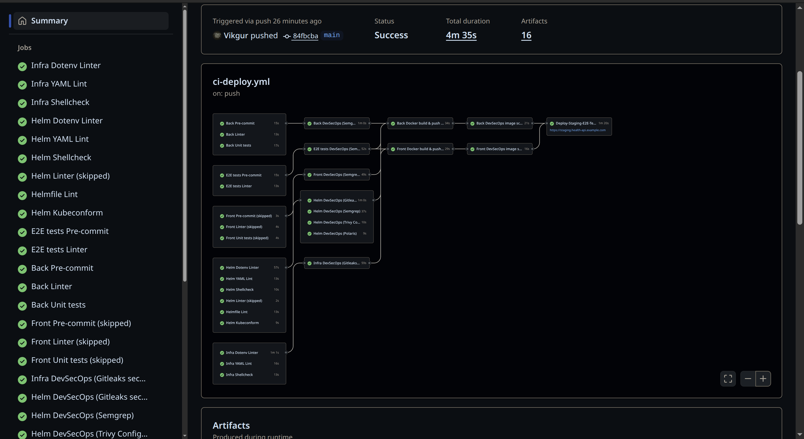
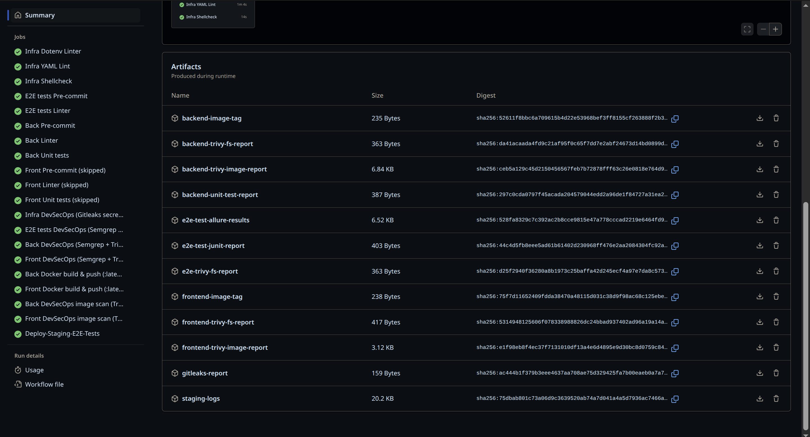

# Table of Contents

- [About the Project](#about-the-project)  
  - [Release Scenario (Stage → Prod)](#release-scenario-stage--prod)
  - [Best Practice Separation](#best-practice-separation)  
  - [Intentional Simplifications](#intentional-simplifications)  
  - [Successful Run](#successful-run)  
  - [Artifacts](#artifacts)  
- [CI/CD Structure](#cicd-structure)  
  - [Architecture](#architecture)  
    - [.github/workflows/ci-deploy.yml](#githubworkflowsci-deployyml)  
    - [.github/workflows/release-image.yml](#githubworkflowsrelease-imageyml)  
  - [Phases](#phases)  
- [DevSecOps Practices](#devsecops-practices)  
  - [Local Checks (pre-commit)](#local-checks-pre-commit)  
  - [Checks Built into CI](#checks-built-into-ci)  
  - [Container Security](#container-security)  

---

# About the Project

The repository demonstrates an **advanced CI/CD infrastructure** for the [`health-api`](https://github.com/vikgur/health-api-for-microservice-stack-english-vers) web application based on **GitHub Actions**.  

A unified pipeline is implemented, covering the full lifecycle of image delivery for release rollouts:

- Container build and vulnerability scanning  
- E2E tests in the stage environment  
- Signing and publishing to GHCR  
- Tag updates via Argo Image Updater  
- Synchronization and release rollout in Argo CD  
- [DevSecOps practices](#devsecops-practices) integrated at all stages  

Only **signed and verified images** reach production.  

**Rollout:**  
- On `stage`, it runs fully automatically through the GitOps chain:  
  **CI → Registry → Cosign → AIU → Argo CD → Rollout**.  
  Stage is always “one step ahead” and tests the latest release.  
- On `prod`, rollout goes through a PR-gate triggered by a manual tag, using the **blue/green + canary** strategy for safe traffic switching and fast rollback capability.  

### Release Scenario (Stage → Prod)

1. **Release 1**  
   - Deployed to Stage and Prod → active color `blue`.  

2. **Release 2**  
   - Automatically updated Stage.  
   - On Prod, deployed as `green` alongside `blue`.  
   - During canary switch a bug was found → rollback to `blue` (`abort/undo`).  
   - Stage stays on release 2, Prod continues running release 1.  

3. **Release 3 (fix)**  
   - New tag → Stage updated.  
   - On Prod, release 3 deployed as `green` alongside `blue` (release 1).  
   - After successful test `promote` → `green` becomes active.  
   - Stage and Prod are synchronized (both on release 3).  

**Principle:** Stage is always “one step ahead,” Prod receives only validated releases via blue-green + canary.  

## Best Practice Separation

For demonstration purposes, everything is combined into a single CI.  
However, in real production systems this process is logically and technically split into separate interconnected pipelines:

1. **ci-validation-devsecops-gitops-health-api**  
   Preliminary validation, linters, IaC analysis, DevSecOps

2. **ci-images-devsecops-gitops-health-api**  
   Build, scan, publish Docker images

3. **ci-e2e-tests-gitops-health-api**  
   Temporary environment, e2e, smoke tests, readiness verification

4. **ci-images-cosign-gitops-health-api**  
   Signing (cosign), production approval, Argo Image Updater integration

Such separation follows GitOps best practices and scalable DevSecOps platforms, ensuring security, independence, and control at every stage.

## Intentional Simplifications

- Heavy IaC practices (OPA/Conftest, Checkov, full policy-as-code) are not duplicated and are placed in dedicated repositories: [`Terraform`](https://github.com/vikgur/terraform-yandex-cloud-health-api-english-vers) / [`Ansible`](https://github.com/vikgur/ansible-gitops-bootstrap-health-api-english-vers) / [`Helm`](https://github.com/vikgur/helm-blue-green-canary-gitops-health-api-english-vers).  
- Staging is a lightweight environment for CI e2e test runs.  

## Successful Run

  

## Artifacts

  

---

# CI/CD Structure

## Architecture

### .github/workflows/ci-deploy.yml

**Purpose:**  
Main workflow that integrates all core directories of the health-api project.

Directories:

- `backend/` — Python API (Flask) + unit tests  
- `frontend/` — SPA on React + Vite  
- `e2e_tests/` — Python (Pytest + Allure)  
- `helm/` — Helm charts and Helmfile for production deploy (K3s)  
- `infra/` — `nginx` and `docker-compose` for all 18 containers (structurally separated)  
- `mvp_compose/` — `nginx` and `docker-compose` for production (only 9 MVP containers)  

### .github/workflows/release-image.yml

**Purpose:**  
Release workflow for publishing container images and creating PRs **to production**.  
It uploads tagged artifacts, rebuilds `backend` and `frontend`, pushes them to GHCR, and signs with `cosign`.  

When a git tag is pushed (e.g., `v1.0.0`) to the main repository:  
1. CI builds and signs the images (`backend`, `frontend`) with tag `v1.0.0`.  
2. CI automatically opens a Pull Request in [`gitops-apps-health-api`](https://github.com/vikgur/gitops-apps-health-api).  
   * Under the hood: `git clone` → edit only required files (`values/*.yaml` and `apps/prod/health-api.yaml`) → new commit → PR.  
   * All other files in `gitops-apps-health-api` remain untouched.  
3. The PR:  
   * updates `values/*.yaml` with the new tag `v1.0.0`,  
   * switches the overlay **blue ↔ green** so that the new version rolls out alongside the old one (blue-green + canary).  
4. After merging the PR, ArgoCD (auto-sync) applies the changes and rolls out the release to **prod** using a blue-green strategy with canary steps.  

## Phases

1. **CI backend** — tests, pre-commit, black, build, Semgrep, Trivy FS, Trivy image, cosign, image push  
2. **CI frontend** — build, Semgrep, Trivy FS, Trivy image, cosign, image push  
3. **E2E tests** — pre-commit, black  
4. **Infra validation** — dotenv-linter, yamllint, shellcheck, gitleaks  
5. **Helm validation** — yamllint, shellcheck, dotenv-linter, gitleaks, kubeconform, helmfile lint, Semgrep, Trivy, Polaris  
6. **Image release**  
   * **Stage** — images get the tag `stage-<shortsha>` (unique per commit). Argo Image Updater tracks new versions, history can be mapped to SHA.  
   * **Prod** — only on git tag `v*`, images are pushed with a fixed `:version`.  
7. **Production deploy (Argo CD)**  
   * **Stage** — auto-sync, each `stage-<sha>` update is deployed automatically.  
   * **Prod** — sync on release tags `v*`; manual gate is enabled (e2e tests, CI approval), after which Argo CD applies auto-sync.  

---

# DevSecOps Practices

The project has **DevSecOps embedded at every stage** — from local development to the CI/CD pipeline.  
Every line of code, every workflow, and every container goes through strict quality and security checks.  
This is not an add-on, but part of the architecture: security is built-in by default, not "bolted on later".  

## Local checks (pre-commit)

- `yamllint` — unified YAML style  
- `semgrep` — detection of insecure patterns in workflows  
- `gitleaks` — protection against secret leaks  
- `checkov` — policies for GitHub Actions  

## Checks built into CI

- `semgrep` — Python/JS analysis (SAST)  
- `trivy fs` — dependency and Dockerfile scan (SCA)  
- `trivy image` — vulnerability scan of images  
- `gitleaks` — secret scanning  
- `dotenv-linter`, `yamllint`, `shellcheck` — config validation  

## Container security

- Image signing via `Cosign`  
- Signature verification inside the cluster  
- Deployment only of trusted images from GHCR  

---

> Thus, the pipeline guarantees:  
> clean code, no secrets, validated workflows, and deployment of trusted signed artifacts only.
