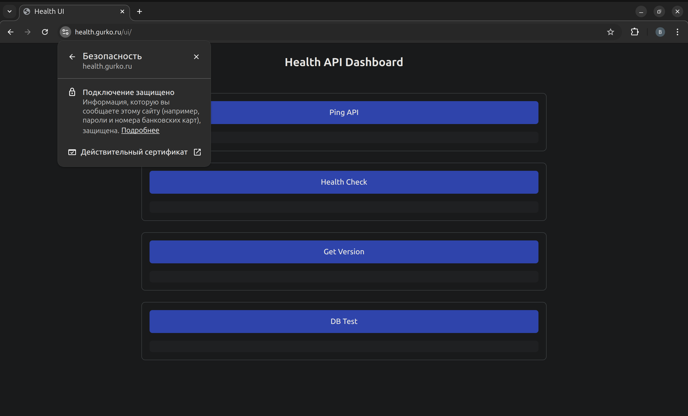

# Table of Contents

- [About the Project](#about-the-project)  
  - [Stack](#stack)  
  - [GitOps](#gitops)  
    - [Infrastructure](#infrastructure)  
    - [CI/CD](#cicd)  
    - [Security / DevSecOps](#security--devsecops)  
    - [Web Application](#web-application)  
    - [Observability](#observability)  
  - [All Related Repositories](#all-related-repositories)  
- [Repository Integration in Production](#repository-integration-in-production)  
  - [Dependency Chain](#dependency-chain)  
  - [CI/CD](#cicd-1)  
    - [Current Project](#current-project)  
    - [Release Scenario (Stage → Prod)](#release-scenario-stage--prod)
    - [Production](#production)  
  - [Repository Organization in Production](#repository-organization-in-production)  
  - [GitOps Change Flow](#gitops-change-flow)  
  - [Release Management (Argo Rollouts)](#release-management-argo-rollouts)  
    - [Deploy via PR](#deploy-via-pr)  
    - [Rollout Strategies](#rollout-strategies)  
    - [Rollout Management](#rollout-management)  
  - [Rollback](#rollback)  
- [Architecture](#architecture)  
  - [MVP in Production](#mvp-in-production)  
    - [Under the Hood](#under-the-hood)  
    - [Yandex Cloud Structure](#yandex-cloud-structure)  
  - [Local Architecture](#local-architecture)  
    - [infra_compose/: Extended Version in Docker Compose](#infra_compose-extended-version-in-docker-compose)  
    - [MVP Version in Minikube](#mvp-version-in-minikube)  
  - [backend/: Backend Service](#backend-backend-service)  
  - [frontend/: Frontend Service](#frontend-frontend-service)  
  - [e2e_tests/: End-to-End Tests](#e2e_tests-end-to-end-tests)  
  - [Makefile](#makefile)  
  - [.github/: CI/CD Structure](#github-cicd-structure)  
    - [Successful Run](#successful-run)  
    - [Artifacts](#artifacts)  
  - [ansible/: Ansible Automation](#ansible-ansible-automation)  
  - [helm/: Dev and Prod Structure](#helm-dev-and-prod-structure)  
  - [terraform/: Terraform/Terragrunt Infrastructure](#terraform-terraformterragrunt-infrastructure)  
  - [Bash Scripts](#bash-scripts)  
- [DevSecOps/Security](#devsecopssecurity)  
  - [security_local/config](#security_localconfig)  
  - [security_local/policy](#security_localpolicy)  
  - [.pre-commit-config.yaml](#pre-commit-configyaml)  

---

# About the Project  

This repository is a **monorepo portfolio**, a demonstration of an **end-to-end DevOps/DevSecOps/GitOps architecture** for the web application [`health-api`](https://github.com/vikgur/health-api-for-microservice-stack-english-vers).

**Completed Task:**  

- **Cloud delivery pipeline:**  
  - A secure supply chain with DevSecOps practices has been deployed.  
  - A separate stage environment has been set up, fully isolated yet identical to prod (on dedicated VMs within the same cloud account).  

- **Local debugging:**  
  - [**Extended version**](#infra_compose-extended-version-in-docker-compose) in `docker-compose` (18 containers: backend, frontend, Kafka/Zookeeper, PostgreSQL + PgBouncer, observability, exporters) launched with a single command via [Makefile](#makefile).  
  - [**MVP version**](#mvp-version-in-minikube) in `Minikube`.  

The entire path — from cloud provisioning to dev/stage/prod deployment, debugging, and application management — has been **reduced to a series of short commands within the GitOps flow**.  

**Monorepo Portfolio:**  

- **Author’s lab** of production-grade microservice architecture.  
- Fully functional and deployable end-to-end.  
- All key components are gathered in one place, with folders containing copies of the original repositories and their README files.  
- In real production, a separate structure of [GitOps repositories](#all-related-repositories) managed by Argo CD is used; here it is adapted into a single monorepo format.  
- A **GitOps deployment pattern** is established: from IaC and CI/CD to production rollout.  
- Implemented [**blue-green + canary**]( #rollout-strategies) strategy for safe progressive rollouts and fast rollback. 
---

## Stack  

The project covers the **full technology spectrum** used in production infrastructure through GitOps automation: from IaC and CI/CD to monitoring and DevSecOps. Below is the list of technologies, grouped by layers with their roles.  

## GitOps  

- **Argo CD** (Rollouts, Image Updater, Ingress, Cert-manager, External Secrets, Monitoring, Policies)  

### Infrastructure  

Infrastructure and container management:  
- **IaC:** Terraform, Terragrunt, Ansible, Bash, Make  
- **Kubernetes:** K3s, K8s (Minikube), Helm, Helmfile  
- **Containerization:** Docker  

### CI/CD  

Automation of build, testing, and delivery:  
- **Pipeline:** GitHub Actions  
- **Code style & linting:** Black, Isort, Flake8  
- **Unit & integration tests:** Python/Pytest  

### Security / DevSecOps  

Supply chain protection, code analysis, and infrastructure validation.  

**CI:**  
- **Supply chain:** Cosign (image signing and verification)  
- **Secrets & leaks:** Gitleaks  
- **Static analysis (SAST):** Semgrep  
- **Vulnerability scanning (SCA):** Trivy FS, Trivy Image  
- **Policy & compliance:** Polaris, Helmfile lint, Yamllint, Shellcheck, Dotenv-linter, Kubeconform  

**CD:**  
- Validation of `.env`, `docker-compose config`  
- Deployment only of trusted images from GHCR (signed with Cosign)  
- Auto-rollout of the stage environment (prod clone)  
- Manual approval for prod via PR-gate  

**Local:**  
- **Policy-as-Code:** OPA/Conftest (Terraform, Kubernetes)  
- **Infrastructure scanning:** Checkov, TFLint  
- **Policy unit tests:** rego security_test.rego (Kubernetes)  

### Web Application  

Application services and components:  
- **Backend:** Python (Flask), Pytest  
- **Frontend:** React, Vite  
- **Testing:** Python/Pytest, Allure  
- **Documentation:** Swagger UI  
- **Brokers:** Kafka, Zookeeper, Redpanda Console  
- **Database:** PostgreSQL, PgBouncer  

### Observability  

Monitoring, metrics, and tracing:  
- **Monitoring & metrics:** Prometheus, VictoriaMetrics, Alertmanager  
- **Visualization:** Grafana  
- **Tracing:** Jaeger  
- **Exporters:** Postgres-exporter, Pgbouncer-exporter, Kafka-exporter  

---

## All Related Repositories  

**Infrastructure / DevOps**  
- [terraform-terragrunt-yandex-cloud-health-api](https://github.com/Vikgur/terraform-terragrunt-yandex-cloud-health-api-english-vers) — provisioning of cloud resources (VPC, VM, k8s cluster) in Yandex Cloud for Prod and Stage.  
- [ansible-gitops-bootstrap-health-api](https://github.com/vikgur/ansible-gitops-bootstrap-health-api-english-vers) → installation of Argo CD with flexible access (SSO via OIDC/Dex or admin with bcrypt).  
- [argocd-config-health-api](https://github.com/vikgur/argocd-config-health-api-english-vers) → Argo CD system configuration (ConfigMap, Repos, Projects, RBAC, Notifications).  
- [gitops-argocd-platform-health-api](https://github.com/vikgur/gitops-argocd-platform-health-api-english-vers) → core platform services (argo-rollouts, argocd-image-updater, ingress-nginx, cert-manager, external-secrets, monitoring, policy-engine).  
- [helm-blue-green-canary-gitops-health-api](https://github.com/vikgur/helm-blue-green-canary-gitops-health-api-english-vers) → production-grade charts and values for dev/stage/prod; deployment strategies via Argo Rollouts (Blue/Green, Canary).  
- [gitops-apps-health-api](https://github.com/vikgur/gitops-apps-health-api-english-vers) → specific applications (stage/prod); Applications for deploying backend, frontend, and nginx from helm-blue-green-canary-gitops-health-api.  
- [ci-gitops-health-api](https://github.com/vikgur/ci-gitops-health-api-english-vers) → CI/CD pipelines: build, scan, and sign containers, update tags in `gitops-apps-health-api`.  
- [bash-scripts-gitops-health-api](https://github.com/Vikgur/bash-scripts-gitops-health-api-english-vers) — bash scripts for deployment and automation.  
- [k8s-local-minikube-health-api](https://github.com/Vikgur/k8s-local-minikube-health-api-english-vers) — local MVP launch in Minikube.  
- [infra-docker-compose-health-api](https://github.com/Vikgur/prod-ready-dockerized-microservice-stack-english-vers) — local infrastructure (18 containers).  

**Application**  
- [backend-health-api](https://github.com/Vikgur/health-api-for-microservice-stack-english-vers) — Flask backend.  
- [frontend-health-api-ui](https://github.com/Vikgur/health-api-ui-for-microservice-stack-english-vers) — React/Vite frontend.  

**E2E Tests**  
- [e2e-tests-health-api](https://github.com/Vikgur/e2e-tests-health-api-for-microservice-stack-english-vers) — E2E tests (Pytest + Allure).  

## Repository Integration in Production

In real production, the project is split into independent GitOps repositories, unified through **Argo CD**.

### Dependency Chain

**Terraform → Ansible Bootstrap → Argo CD Config → Argo CD Platform → Helm → Argo CD Apps → CI/E2E Tests → CD → Stage/Prod**  

Execution order and repository interaction:

1. **Prepare Git repositories**  
   - All configs are edited locally and pushed:  
     - [`argocd-config-health-api`](https://github.com/vikgur/argocd-config-health-api-english-vers)  
     - [`gitops-argocd-platform-health-api`](https://github.com/vikgur/gitops-argocd-platform-health-api-english-vers)  
     - [`helm-blue-green-canary-gitops-health-api`](https://github.com/vikgur/helm-blue-green-canary-gitops-health-api-english-vers)  
     - [`gitops-apps-health-api`](https://github.com/vikgur/gitops-apps-health-api-english-vers)  
   - Repositories must exist in Git **before Argo CD installation**, so it can pull them.  

2. **Environment creation (stage/prod)**  
   - From [`terraform-terragrunt-yandex-cloud-health-api`](https://github.com/Vikgur/terraform-terragrunt-yandex-cloud-health-api-english-vers):  
     networks, VMs, and k3s clusters are created in Yandex Cloud.  

3. **Bootstrap (Ansible)**  
   - From [`ansible-gitops-bootstrap-health-api`](https://github.com/vikgur/ansible-gitops-bootstrap-health-api-english-vers):  
     installation of all required components, including Argo CD.  
   - A minimal bootstrap `Application` is applied, pointing to [`argocd-config-health-api`](https://github.com/vikgur/argocd-config-health-api-english-vers).  

4. **Argo CD system config**  
   - Argo CD pulls manifests from [`argocd-config-health-api`](https://github.com/vikgur/argocd-config-health-api-english-vers):  
     Repos, Projects, RBAC, Notifications.  

5. **Platform (App-of-Apps)**  
   - Argo CD syncs [`gitops-argocd-platform-health-api`](https://github.com/vikgur/gitops-argocd-platform-health-api-english-vers):  
     image-updater, ingress-nginx, cert-manager, external-secrets, rollouts, monitoring, policies.  

6. **Charts and values**  
   - Source in [`helm-blue-green-canary-gitops-health-api`](https://github.com/vikgur/helm-blue-green-canary-gitops-health-api-english-vers).  
   - Consumed by applications, not deployed manually.  

7. **Applications (stage/prod)**  
   - Argo CD applies [`gitops-apps-health-api`](https://github.com/vikgur/gitops-apps-health-api-english-vers):  
     backend, frontend, nginx.  
   - Stage → auto-sync, prune, selfHeal.  
   - Prod → only via PR gate.  

8. **CI/CD**  
   - From [`ci-gitops-health-api`](https://github.com/vikgur/ci-gitops-health-api-english-vers):  
     build, scan, and sign images.  
   - Auto-deploy to stage via Argo Image Updater.  
   - Prod — only via PR to [`gitops-apps-health-api`](https://github.com/vikgur/gitops-apps-health-api-english-vers).   

### CI/CD  

#### Current Project

In the current project, the pipeline runs **automatically in GitHub Actions** from [`ci-gitops-health-api`](https://github.com/vikgur/ci-gitops-health-api-english-vers).  
The repository must contain all required directories: backend, frontend, e2e_tests, helm, infra_compose (excluded from `ci-gitops-health-api` to focus solely on pipeline logic).  

Implemented:  
- Build, scan, and sign containers.  
- Push images to Registry for E2E tests.  
- E2E tests: only successfully tested images are tagged in Registry and promoted further.  
- Auto-tagging and auto-deploy to `stage` via Argo Image Updater for acceptance tests.  
- For `prod` — manual tagging + Pull Request updating tags in `gitops-apps-health-api` (PR-gate).  

#### Release Scenario (Stage → Prod)

1. **Release 1**  
   - Deployed to Stage and Prod → active color `blue`.  

2. **Release 2**  
   - Automatically updated Stage.  
   - On Prod, deployed as `green` alongside `blue`.  
   - During canary switch a bug was found → rollback to `blue` (`abort/undo`).  
   - Stage stays on release 2, Prod continues running release 1.  

3. **Release 3 (fix)**  
   - New tag → Stage updated.  
   - On Prod, release 3 deployed as `green` alongside `blue` (release 1).  
   - After successful test `promote` → `green` becomes active.  
   - Stage and Prod are synchronized (both on release 3).  

**Principle:** Stage is always “one step ahead,” Prod receives only validated releases via blue-green + canary.  

#### Production

- **Monolithic pipeline** (as in the current project) — a valid production pattern: linters, DevSecOps, build, scanning, E2E → only verified images are pushed to Registry.  
- **Split pipelines** (validation, build, e2e, signing) are used in large-scale production systems: faster feedback, parallel execution, strict security control.  

In this project, the monolithic approach is shown for clarity, but understanding both schemes is important:  
monolithic = practicality, split = best practice for large platforms.  

---

### Repository Organization in Production

In real production, all repositories are hosted under a single GitHub/GitLab **organization** (e.g., `company-health-api`).  
Access is restricted by roles:  

- **DevOps (full access)**  
  - all infrastructure repositories (`terraform`, `ansible`, `argocd-config`, `gitops-argocd-platform`, `helm-blue-green-canary`, `gitops-apps`, `ci-gitops`)  
  - application repositories (`backend`, `frontend`)  
  - tests (`e2e-tests`)  
  - utilities (`bash-scripts`, `k8s-local-minikube`, `infra-docker-compose`)  

- **Backend developers**  
  - `backend-health-api`  

- **Frontend developers**  
  - `frontend-health-api-ui`  

- **AQA (test engineers)**  
  - `e2e-tests-health-api`  

Thus:  
- DevOps has access to the entire stack (end-to-end).  
- Developers and AQA work only within their area of responsibility.  
- Access control in the organization is managed through Teams/Groups.  

### GitOps Change Flow  

- **Initialization**: initial configuration versions are fixed in `master`  
  ([`helm-blue-green-canary-gitops-health-api`](https://github.com/vikgur/helm-blue-green-canary-gitops-health-api-english-vers),  
  [`gitops-apps-health-api`](https://github.com/vikgur/gitops-apps-health-api-english-vers),  
  [`argocd-config-health-api`](https://github.com/vikgur/argocd-config-health-api-english-vers),  
  [`gitops-argocd-platform-health-api`](https://github.com/vikgur/gitops-argocd-platform-health-api-english-vers),  
  [`terraform-terragrunt-yandex-cloud-health-api`](https://github.com/Vikgur/terraform-terragrunt-yandex-cloud-health-api-english-vers),  
  [`ansible-gitops-bootstrap-health-api`](https://github.com/vikgur/ansible-gitops-bootstrap-health-api-english-vers)).  

- **Workflow**: all changes are made in separate branches, then merged into `master` via Pull Request.  

- **Synchronization**: Argo CD tracks `master` and automatically reconciles the cluster to match its state.  

- **Fallback**: direct in-cluster changes are allowed only for debugging, as they cause drift and will be overwritten by Argo CD.  

### Release Management (Argo Rollouts)

#### Deploy via PR

* The [`gitops-apps-health-api`](https://github.com/vikgur/gitops-apps-health-api-english-vers) repository is used as the entry point for updating image tags.  
* After changes are merged, Argo CD syncs the configuration and triggers a rollout via Argo Rollouts.  

#### Rollout Strategies

* Defined in [`helm-blue-green-canary-gitops-health-api`](https://github.com/vikgur/helm-blue-green-canary-gitops-health-api-english-vers) under `values-*.yaml`.  
* Supports Blue/Green and Canary.  
* When strategy configuration changes, Argo CD automatically picks up the new values and applies them.  

#### Rollout Management

The process is controlled via **Argo Rollouts** (CLI or UI):

```bash
kubectl argo rollouts get rollout <name>      # status view – shows the current state of the rollout (versions, traffic, steps, revisions)
kubectl argo rollouts promote <name>          # promotion – manually advances the rollout to the next step or finishes it early
kubectl argo rollouts abort <name>            # abort or rollback – stops the current rollout and routes traffic back to the previous stable version
kubectl argo rollouts undo <name> --to-revision=<n>  # revert to revision – rolls the application back to the specified revision (n)
```

The CLI works locally through the configured `kubectl`, interacting with the Kubernetes cluster API.

No need to log into the VM to manage rollouts.

* Install `kubectl` and the `argo-rollouts` plugin locally.
* Configure cluster access via `kubeconfig`
  (for example, `yc managed-kubernetes cluster get-credentials` or export from master).
* All commands are executed locally, interacting directly with the cluster API server.

### Rollback  

- Supported by Argo Rollouts’ built-in undo functionality.  
- Can be executed via CLI or Argo CD UI (revision selection).  
- Additional fallback scenarios are supported via Helmfile and Makefile (described in [`helm-blue-green-canary-gitops-health-api`](https://github.com/vikgur/helm-blue-green-canary-gitops-health-api-english-vers)):  
  - Blue/Green: switch traffic between slots (*-blue / *-green).  
  - Canary: stop rollout at a step or fully revert to the previous version.  
  - Helmfile commands allow manual deployment of a stable image or restoration of a removed slot.  
- Important: manual rollback causes drift with Git.  
  - On stage (auto-sync + selfHeal), Argo CD will automatically reconcile the cluster to the Git state.  
  - On prod (PR-gate), Argo CD will show OutOfSync but won’t apply changes without approval.  
- Therefore, in production, rollback is performed only through Git (tag updates and PR merge), while CLI/Helmfile remain fallback tools.  

---

# Architecture

This section describes the folder structure of the current monorepo and provides links to related project repositories responsible for different parts of the infrastructure and application.

## MVP in Production  

UI with 4 buttons, all requests routed through `nginx`:  

  

- **Ping API** — checks API availability  
- **Health Check** — service self-check  
- **Get Version** — backend version  
- **DB Test** — PostgreSQL connection (insert user)  

Additional:  

- **Swagger:**  
  > Swagger endpoint is protected with `nginx` authentication: `admin` / `admin`  

  

### Under the Hood  

- Monorepo with CI/CD and DevSecOps.  
- Local — **Minikube**, production — **k3s** cluster on 3 VPS in **Yandex Cloud**.  
- Deployment and management — via **Helm + Helmfile**.  
- Application runs in Kubernetes: autoscaling, self-healing, isolation, scalability.  
- HTTPS via **cert-manager + Let’s Encrypt**.  
- All images are built and tagged in CI/CD, push — manual.  
- Built-in k3s components used:  
  - `CoreDNS` — in-cluster DNS  
  - `local-path-provisioner` — local storage  
  - `metrics-server` — HPA and monitoring  
  - `svclb` — load balancing for ingress controller  

### Yandex Cloud Structure  


---

## Local Architecture  

### infra_compose/: Extended Version in Docker Compose  

In `infra_compose/`, the full technology stack of the project runs (18 containers), including backend, frontend, Kafka/Zookeeper brokers, PostgreSQL + PgBouncer, observability (Prometheus, VictoriaMetrics, Grafana, Jaeger, Alertmanager), and exporters.  

> Detailed description of services, endpoints, and override configurations — in the separate repository [infra-docker-compose-health-api](https://github.com/Vikgur/prod-ready-dockerized-microservice-stack-english-vers).  

### MVP Version in Minikube  

Local project launch in **Minikube** for practicing the DevOps cycle. Managed via **Helm**, using both ready-made (PostgreSQL) and custom charts (backend, frontend, nginx, swagger).  

Services:  
- **backend** — Flask API (2 pods).  
- **frontend** — React SPA.  
- **postgres** — database.  
- **nginx** — ingress and entrypoint.  
- **swagger** — OpenAPI UI.  
- **jaeger** — stub for traces.  

> Details and instructions — in the separate repository [k8s-local-minikube-health-api](https://github.com/Vikgur/k8s-local-minikube-health-api-english-vers).  

## backend/: Backend Service  

The `backend/` directory contains a **Python (Flask)** API with basic business logic, health-check endpoints, and integration with PostgreSQL and Kafka. **Pytest** is used for unit testing, and the configuration is wrapped in a Dockerfile and Helm chart.  

> Detailed description of the service and its code — in the separate repository [backend-health-api](https://github.com/Vikgur/health-api-for-microservice-stack-english-vers).  

## frontend/: Frontend Service  

The `frontend/` directory implements a SPA interface using **React + Vite**, which interacts with the backend via REST API. The project is packaged into a Docker image, static files are served through Nginx, with integration available for Swagger UI.  

> Detailed description of frontend implementation and build — in the separate repository [frontend-health-api-ui](https://github.com/Vikgur/health-api-ui-for-microservice-stack-english-vers).  

## e2e_tests/: End-to-End Tests  

The `e2e_tests/` directory contains **E2E tests** in Python (**Pytest + Allure**) for validating application functionality in production and stage. Core UI and API scenarios are tested, using a dedicated CI workflow.  

> Detailed description of the test structure and report generation — in the separate repository [e2e-tests-health-api](https://github.com/Vikgur/e2e-tests-health-api-for-microservice-stack-english-vers).  

## Makefile  

The file is kept minimalistic — as an example of running infrastructure tasks uniformly via `make`. It can be easily extended with new commands (Helm, CI checks, deploy, etc.).  

The current Makefile in the repository root acts as a façade for local infrastructure operations:  

- **infra_compose-up / down** — start and stop the full environment via Docker Compose.  
- **infra_compose-lint** — local DevSecOps checks for `infra_compose/` (`dotenv-linter`, `yamllint`, `shellcheck`, `gitleaks`).  
- **services-test** — run service tests (placeholder for demonstration).  
- **docs-sync** — sync documentation (placeholder).  

## .github/: CI/CD Structure  

Unified CI/CD implemented with **GitHub Actions** for the following directories:  
- `backend/` — API (Flask) + unit tests.  
- `frontend/` — SPA (React + Vite).  
- `e2e_tests/` — e2e tests (Pytest + Allure).  
- `helm/` — charts and Helmfile for production deployment.  
- `infra/` — `nginx` and docker-compose for all 18 containers.  
- `mvp_compose/` — simplified production stack (9 containers).  

Workflows:  
- `.github/workflows/ci-deploy.yml` — main CI/CD process.  
- `.github/workflows/release-image.yml` — release of backend/frontend images.  

### Successful Run  

  

### Artifacts

  

> Detailed pipeline structure and description — in the separate repository [ci-gitops-health-api](https://github.com/Vikgur/ci-gitops-health-api-english-vers).  

## ansible/: Ansible Automation  

The `ansible/` directory contains roles for installing and configuring the **k3s cluster**, as well as deploying the application via Helmfile. Environments are split into stage and prod, with configurations stored in `inventories/`.  

> Detailed description of roles, playbooks, and DevSecOps practices — in the separate repository [ansible-gitops-bootstrap-health-api](https://github.com/vikgur/ansible-gitops-bootstrap-health-api-english-vers).  

## helm/: Dev and Prod Structure  

The `helm/` directory stores a unified set of charts and values for both Dev and Prod, implementing **Blue/Green** and **Canary** deployment strategies. Dev and Prod use the same charts, with differences defined only through values.  

> Detailed description of implemented deployment strategies, Kubernetes Best Practices in Helm charts, and DevSecOps practices — in the separate repository [helm-blue-green-canary-gitops-health-api](https://github.com/vikgur/helm-blue-green-canary-gitops-health-api-english-vers).  

## terraform/: Terraform/Terragrunt Infrastructure  

The `terraform/` directory describes IaC infrastructure in **Yandex Cloud**: networks, VMs for the k3s cluster, and related resources. It uses Object Storage as backend, with variables stored in tfvars.  

> Detailed description of infrastructure and DevSecOps practices — in the separate repository [terraform-terragrunt-yandex-cloud-health-api](https://github.com/Vikgur/terraform-terragrunt-yandex-cloud-health-api-english-vers). 

## Bash Scripts  

The project includes a set of **Bash scripts** to automate routine steps: generating the Ansible inventory, syncing files to the master node, running playbooks, and auxiliary operations during deployment.  

Scripts follow best practices to minimize manual actions.  

> Full description and complete script set — in the separate repository [bash-scripts-gitops-health-api](https://github.com/Vikgur/bash-scripts-gitops-health-api-english-vers).  

---

# DevSecOps/Security

The project includes a demonstration **DevSecOps** layer for the **monorepo** pattern: baseline configurations are used for static analysis, secret detection, vulnerability scanning, and auditing Kubernetes/Terraform via Policy-as-Code. Core configs are in `security_local/config`, and rules are in `security_local/policy`.

## security_local/config  

Configurations for **DevSecOps** tools:  

- **checkov/base.yaml** — baseline for Terraform and Kubernetes analysis.  
- **semgrep/base.yml** — static code analysis rules.  
- **gitleaks/base.toml** — secret and key detection.  
- **polaris/polaris.yaml** — Kubernetes manifest audit for best practices.  
- **trivy/trivy.yaml** — filesystem and image scanning.  
- **yamllint/yamllint.yaml** — YAML validation (Helm, Ansible, CI) for style and errors.  

## security_local/policy  

**Policy-as-Code** rules for infrastructure and Kubernetes manifest validation via **OPA/Conftest**:  

- **terraform/security.rego** — Terraform checks (deny `0.0.0.0/0`, require tags, KMS for storage).  
- **kubernetes/security.rego** — Pod/Deployment/Service checks (`runAsNonRoot`, deny privileged, hostNetwork/hostPID/hostIPC, enforce requests/limits).  
- **kubernetes/security_test.rego** — unit tests for rego rules.  

## .pre-commit-config.yaml  

**pre-commit** hook configuration for automated checks before committing.  
Includes:  

- **Python**: Black, Isort, Flake8  
- **Frontend**: Prettier  
- **Bash**: Shellcheck  
- **YAML**: Yamllint (config `security_local/config/.yamllint.yml`)  
- **Dotenv**: dotenv-linter  
- **Kubernetes/Helm**: Helm lint, Helmfile lint, Kubeconform (`-strict`)  
- **Ansible**: ansible-lint  
- **DevSecOps**:  
  - Gitleaks (config `security_local/config/gitleaks/.gitleaks.toml`)  
  - Semgrep (config `security_local/config/semgrep`)  
- **Generic**: trailing-whitespace, end-of-file-fixer, check-yaml, check-json, check-added-large-files, detect-private-key  

Used to enforce code consistency, detect errors early, and ensure quality at the local development stage.  
