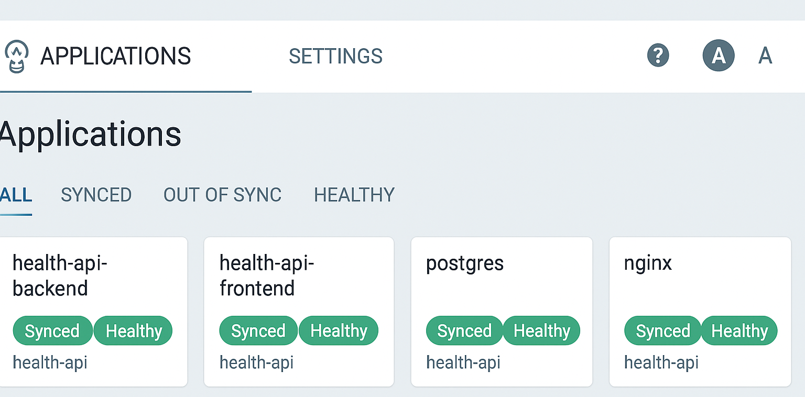

# Table of Contents

* [About the Project](#about-the-project)
  * ["Closed stage/prod" Pattern](#closed-stageprod-pattern)
  * [Image Delivery](#image-delivery)
    * [GitOps Scenario](#gitops-scenario)
    * [Fallback/Manual Scenario](#fallbackmanual-scenario)
* [Structure](#structure)
  * [Main Files and Directories](#main-files-and-directories)
  * [Ansible Scripts](#ansible-scripts)
* [Environment Configurations](#environment-configurations)
  * [ansible/ Structure](#ansible-structure)
    * [roles/](#roles)
      * [Core (GitOps)](#core-gitops)
      * [Auxiliary (manual / fallback)](#auxiliary-manual--fallback)
* [Entry Point: Makefile](#entry-point-makefile)
  * [Available Commands](#available-commands)
  * [Typical Run Scenarios](#typical-run-scenarios)
* [Launch Instructions](#launch-instructions)
  * [Deployment Steps Logic](#deployment-steps-logic)
* [Playbook: Execution Steps](#playbook-execution-steps)
* [Implemented DevSecOps Practices](#implemented-devsecops-practices)
  * [Access (Authentication)](#access-authentication)  
    * [SSO GitHub OAuth (`oidc` mode)](#sso-github-oauth-oidc-mode)  
    * [SSO Dex (`dex` mode)](#sso-dex-dex-mode)  
    * [Login/Password (`login` mode)](#loginpassword-login-mode)  
    * [Access Control and Security](#access-control-and-security)
  * [RBAC and Argo CD Security](#rbac-and-argo-cd-security)
  * [Security Architecture](#security-architecture)
  * [Coverage](#coverage)
    * [Basic Checks](#basic-checks)
    * [Linters and SAST](#linters-and-sast)
    * [Policy-as-Code](#policy-as-code)
    * [Configuration and Secret Security](#configuration-and-secret-security)
      * [Ansible Vault Setup](#ansible-vault-setup)
    * [CI/CD and Infrastructure](#cicd-and-infrastructure)
  * [Result](#result)
  * [Running Checks](#running-checks)
  * [OWASP Top-10 Compliance](#owasp-top-10-compliance)

---

# About the Project

This project is a production-ready automated configuration management setup for the [`health-api`](https://github.com/vikgur/health-api-for-microservice-stack-english-vers) web application using **Ansible** and **GitOps powered by Argo CD**.  
The repository bootstraps a k3s cluster on virtual machines in **Yandex Cloud**, installs system components (ingress, Argo CD, GHCR secrets), and prepares the environment for further management via GitOps.  

Key Objectives:

* full automation of master/worker node setup using Ansible;  
* environment preparation for Argo CD and GitOps pattern;  
* application of Projects, RBAC, and Git repositories configuration from [`argocd-config-health-api`](https://github.com/vikgur/argocd-config-health-api-english-vers);  
* Applies Argo CD Applications (`stage`, `prod`) from [`gitops-apps-health-api`](https://github.com/vikgur/gitops-apps-health-api-english-vers), automatically pulling manifests based on the environment variable.
* configuration of access to the private GHCR registry;  
* deployment of the ingress controller;  
* use of a [Makefile](#entry-point-makefile) and a series of `bash` scripts for reproducible execution;  
* implementation of up-to-date [DevSecOps practices](#implemented-devsecops-practices) with optimal coverage;  
* container delivery via [GitOps workflow](#gitops-workflow).



## "Closed stage/prod" Pattern

**The project implements a `stage/prod` pattern with isolated workers and GitOps-driven management:**  

- The master node has public access, while workers are fully isolated from the outside world.  
- Ansible bootstrap performs only the initial setup (installing k3s, ingress, Argo CD, GHCR secrets).  
- After that, management is fully delegated to Argo CD: deploying services, rollout strategies (blue/green, canary), and configuration drift control.  
- Separation into `stage` and `prod` guarantees environment parity: all changes are tested on stage before being promoted to production.  

This pattern reflects production-grade systems: security, drift prevention, and reproducibility are ensured by the GitOps approach combined with Argo CD.  

## Image Delivery

### GitOps Scenario

Roles and playbooks in this project follow the primary GitOps scenario:

* Workers remain closed but have outbound access (via Yandex Cloud NAT).  
* Images are pulled directly from GHCR over HTTPS.  
* Access is provided via `imagePullSecrets` (`ghcr-secret`).  
* `images_*` roles are not used (kept only as fallback).  

### Fallback/Manual Scenario

The project also includes basic roles for a Fallback/Manual scenario:

* Workers are completely closed, with no public IPs and no internet access.  
* Images can be built locally using `images_*` roles and transferred as `.tar` files to the nodes.  
* Supports a fully isolated environment.  

> Detailed description of roles and playbooks for the Fallback/Manual scenario can be found in a separate repository: [ansible-manual-health-api](https://github.com/Vikgur/ansible-manual-health-api-english-vers).  

---

# Structure

## Main Files and Directories

* **ansible/** — boilerplate for reproducible cluster setup/update and application deployment across two environments (stage/prod).  
* **.ansible-lint** — ansible-lint configuration: production profile, exceptions, strict rules.  
* **.gitignore** — excludes artifacts (vault keys, logs, tmp files) from Git.  
* **.gitleaks.toml** — gitleaks rules: secret scanning, ignores for encrypted files and artifacts.  
* **.pre-commit-config.yaml** — hooks for automated checks (ansible-lint, yamllint, shellcheck, gitleaks).  
* **.yamllint.yml** — yamllint rules (YAML style and validation).  
* **Makefile** — single entry point: linters, DevSecOps checks, ansible-playbook, bash scripts.  
* **README.md** — project documentation: structure, launch instructions, DevSecOps practices.  

## Ansible Scripts

* **add_ips_to_hosts.sh** — collects node IPs and generates `ansible/inventories/<env>/hosts.yaml`.  
* **sync_to_master.sh** — syncs directories (`ansible/`, `helm/`, `charts/`) to the master node.  
* **run_ansible_on_master.sh** — runs the Ansible playbook directly from the master node (used by `make deploy`, `make bootstrap-argocd`) and applies the Argo CD configuration (Projects, RBAC, Git repositories) from the cloned GitOps repositories.

---

# Environment Configurations

* **ansible/group_vars/prod** — production variables: GHCR access, image tags, deployment parameters.  
* **ansible/group_vars/stage** — exact copy of production for testing in an identical environment.  
* **ansible/group_vars/vault** — encrypted secrets with Ansible Vault (tokens/passwords, etc.).  
* **ansible/inventories/prod** — production cluster inventory (master/workers, connections).  
* **ansible/inventories/stage** — stage cluster inventory.  

## ansible/ Structure

All environment-specific data is placed in group_vars and inventories. Secrets are handled via Ansible Vault.

* `group_vars/` — environment-specific and shared variables.  
  * `prod/`  
    * `ghcr.yaml` — registry/secret parameters, namespace, pull policy.  
    * `version.yaml` — image tags and release version for production deploy.  
  * `stage/`  
    * `ghcr.yaml` — same as prod, but for stage.  
    * `version.yaml` — tags/versions for stage.  
  * `vault/`  
    * `vault.yaml` — encrypted secrets (e.g., GHCR_TOKEN).  
  * `master.yaml` — common master variables (paths/settings independent of environment).  
* `inventories/`  
  * `prod/hosts.yaml` — hosts and connections for production.  
  * `stage/hosts.yaml` — hosts and connections for stage.  
* `roles/` — roles with idempotent logic.  
* **.vault_pass.txt** — file containing the Ansible Vault password (for automatic decryption).  
* **ansible.cfg** — global Ansible configuration (roles path, inventory, ssh settings, retries).  
* **playbook.yaml** — main playbook: calls roles (k3s, docker, deploy, etc.) for installation and deployment.  
* **requirements.yml** — list of external Ansible roles/collections to be installed via `ansible-galaxy`.   

### roles/

#### Core (GitOps):
   * **argocd** — install and bootstrap Argo CD in the cluster.  
   * **argocd-apps** — applies Argo CD Applications (`stage`, `prod`) from the pre-cloned `gitops-apps-health-api` repository.
   * **argocd-config** — configuration of Projects, RBAC, Git repositories, and Argo CD controller parameters from the cloned argocd-config-health-api repository.
   * **common** — base environment setup (packages, ssh, system utilities).  
   * **docker** — install and configure docker/ctr utilities needed for working with images.  
   * **ghcr** — configure access to GitHub Container Registry (secrets, login).  
   * **ingress** — setup ingress-nginx controller and dependencies.  
   * **k3s** — install and configure k3s server/agents, basic checks.  
   * **kubernetes-tools** — utilities for working with the cluster (kubectl, helm, helmfile, etc.).  

**roles/argocd/templates:**

* **argocd-cm.yaml.j2** — base Argo CD ConfigMap (disables anonymous access, enables status badges, disables exec).  
* **argocd-rbac-cm.yaml.j2** — RBAC policies: admin access, readonly as default.  
* **ingress.yaml.j2** — Ingress without TLS (http), used for quick bootstrap or when cert-manager is not ready.  
* **ingress-tls.yaml.j2** — Ingress with TLS (https), used with cert-manager and ClusterIssuer.  

#### Auxiliary (manual / fallback):
   * **deploy** — deploy application via helm/helmfile using VERSION.  
   * **distribute_tar_images** — distribute .tar images to nodes.  
   * **images_copy_to_agents** — copy prepared images from master to workers.  
   * **images_master** — prepare and export images on master.  
   * **import_images_on_agents** — import previously copied images on workers.  
   * **nginx_fix** — fix nginx issues/patches after installation.  

---

# Entry Point: Makefile

The project uses a `Makefile` as a single entry point. All main actions — linters, inventory preparation, sync, and deployment — are run through `make`.

## Available Commands

* `make help` — list available targets.  
* `make lint ENV=stage` — run DevSecOps checks (`ansible-lint`, `yamllint`, `shellcheck`).  
* `make add-ips ENV=stage` — fetch IPs from Yandex Cloud and update `ansible/inventories/stage/hosts.yaml`.  
* `make sync ENV=stage` — sync the `ansible/` directory and helper files to the master node.  
* `make deploy ENV=stage` — connect to the master and run `ansible-playbook` for installation and deployment.  
* `make all ENV=stage` — run the full deployment pipeline: `lint → add-ips → sync → deploy`.  
* `make bootstrap-argocd ENV=stage` — one-time bootstrap of Argo CD (runs only the `argocd` role).  

## Typical Run Scenarios

* **First run** (bootstrap Argo CD on stage):

```bash
make lint ENV=stage
make all  ENV=stage
make bootstrap-argocd ENV=stage
```

* **Repeat run** (any environment):

```bash
make lint ENV=<stage|prod>
make all  ENV=<stage|prod>
```

* **Step-by-step** (example for prod):

```bash
make add-ips ENV=prod && \
make sync    ENV=prod && \
make deploy  ENV=prod
```

> Without `ENV`, targets will not run (protection against accidental deploy).

---

# Launch Instructions

1. Install local dependencies: `ansible`, `ansible-lint`, `yamllint`, `shellcheck`, `pre-commit`, `gitleaks`.

   > Argo CD and other components are installed via playbook, no manual installation needed.

2. [Configure Ansible Vault](#настройка-ansible-vault) (`.vault_pass.txt` with password).

3. Add SSH keys to the cloud (Terraform already did this).

4. Deploy to stage:

```bash
make all ENV=stage
```

5. (one-time) bootstrap Argo CD:

```bash
make bootstrap-argocd ENV=stage
```

6. After validation — deploy to prod:

```bash
make all ENV=prod
```

## Deployment Steps Logic

1. **lint** — code and config checks.
2. **add-ips** — fetch VM IPs and generate inventory.
3. **sync** — sync ansible/ and dependencies to master.
4. **deploy** — run playbook (k3s, ingress, Argo CD, GHCR secrets).

---

## Playbook: Execution Steps

1. **Base Setup** — install utilities, packages, and the Kubernetes Python module.
2. **Agents** — deploy k3s worker nodes and connect them to the master.
3. **Namespace** — create the `health-api` namespace for applications.
4. **Tools** — install Helm, Helmfile, and required plugins on the master node.
5. **Docker** — install Docker if needed for auxiliary tasks.
6. **Ingress** — deploy ingress-nginx for external traffic access.
7. **Argo CD** — install Argo CD into the `argocd` namespace.
8. **GHCR Secrets** — create `ghcr-secret` in both `argocd` and `health-api` namespaces for private image access.
9. **Checks** — verify that all nodes are in the Ready state.
10. **Argo CD Config** — apply Argo CD configuration (Projects, RBAC, Repos) from the `argocd-config-health-api` repository.
11. **Argo CD Applications** — applies `Application` manifests (`stage`, `prod`) from the `gitops-apps-health-api` repository using the `argocd-apps` role.
12. **NodePort (optional)** — patch ingress service to `NodePort` mode for external access without a load balancer.

---

# Implemented DevSecOps Practices

The project is organized around a secure `stage/prod` pattern with closed worker ports; DevSecOps practices are built in as a mandatory control and validation layer.

Required for checks: **ansible-lint**, **yamllint**, **shellcheck**, **pre-commit**, **gitleaks**.

## Access (Authentication)

The project supports three authentication modes for Argo CD:

* `oidc` — direct GitHub OAuth integration (primary)
* `dex` — via the Dex OIDC proxy
* `login` — basic login/password using bcrypt

### SSO GitHub OAuth (`oidc` mode)

Production uses GitHub SSO:

* Direct integration via `oidc.config`
* Uses GitHub organization groups: `g:devops`, `g:qa`
* Security settings (RBAC, AppProjects) are based on these groups

The Argo CD UI shows a **"Login with GitHub"** button.

### SSO Dex (`dex` mode)

The project also supports Dex-based SSO:

* Dex acts as an OIDC proxy between Argo CD and GitHub
* Uses the same GitHub groups: `g:devops`, `g:qa`
* RBAC and AppProject permissions are configured the same as in `oidc` mode

### Login/Password (`login` mode)

To generate a bcrypt hash for the UI password:

```bash
htpasswd -nbBC 10 admin 'MyStrongPass123' | cut -d: -f2
```

* **admin** — username
* **MyStrongPass123** — password

Insert the result into `group_vars/master.yaml` as `admin_password_bcrypt`.

After deployment, access will be:

* username: `admin`
* password: `MyStrongPass123`

This mode is used for local debugging or isolated environments without external SSO.

### Access Control and Security

* RBAC based on groups is enabled (defined in `argocd/cm/argocd-rbac-cm.yaml`)
* In `oidc` and `dex` modes, roles are assigned automatically via GitHub login
* In `login` mode, access is restricted by IP using Ingress annotations

## RBAC and Argo CD Security

Argo CD implements centralized access control via an **RBAC policy** defined in the `argocd-config-health-api` repository (`argocd/cm/argocd-rbac-cm.yaml`):

* `admin` role — full access to all applications and projects  
* `stage-admin` role — limited access to the `stage` environment only  
* Role assignment is based on groups (`g:devops`, `g:qa`)  
* `prod` environment is protected by sync windows that restrict deployment time

The RBAC policy is managed via GitOps and applied automatically from the configuration repository. This eliminates manual errors and ensures change auditability.


## Security Architecture

* **.pre-commit-config.yaml** — hooks for running ansible-lint, yamllint, shellcheck, and gitleaks on every commit.
* **.ansible-lint** — profile and exceptions for strict validation of roles and playbooks.
* **.yamllint.yml** — YAML style and syntax rules (two environments, vault ignored).
* **.gitignore** — excludes artifacts (tar-images, retry files, vault password).
* **.gitleaks.toml** — secret scanning rules, exclusions for encrypted files and binaries.
* **Principles for bash scripts** — standards: shebang `#!/usr/bin/env bash`, `set -Eeuo pipefail`, safe IFS, argument validation, `exit 1` on errors.
* **Makefile** — targets `lint` and `secrets-scan` to run DevSecOps checks with one command.
* **.vault\_pass.txt** + **group\_vars/vault/** — secrets encrypted via Ansible Vault, password stored outside Git.

## Coverage

### Basic Checks

* **yamllint** — unified style and YAML syntax validation.
* **ansible-lint** — role errors, best practices.
  → *Secure SDLC principle*: early error detection.

### Linters and SAST

* **shellcheck** — bash script analysis, protection against common mistakes.
* **ansible-lint** — idempotency check, prohibition of unsafe constructs.
  → Compliance with *OWASP IaC Security* and *CIS Benchmarks*: avoidance of unsafe practices.

### Policy-as-Code

* **ansible-lint** with production profile: ban on unsafe tasks (`command` without `creates`, `shell` without `changed_when`, etc.).
  → *OWASP Top-10*:

  * A5 Security Misconfiguration,
  * A4 Insecure Design.

### Configuration and Secret Security

* **Ansible Vault** — storing tokens and passwords only in encrypted form.

* **.vault\_pass.txt** — password not stored in Git, used only on the server.
  → *OWASP A2 Cryptographic Failures*: secret protection.
  → *OWASP A3 Injection*: exclusion of secrets from code.

* **Gitleaks** — scanning for secrets in code and commits, prevents leaks of access tokens and passwords.
  → *OWASP A2 Cryptographic Failures*: prevention of storing secrets in plaintext.
  → *OWASP A3 Injection*: protection against accidental hardcoded credentials.
  → *OWASP A5 Security Misconfiguration*: no sensitive data in the repository.

#### Ansible Vault Setup

1. Create the file `ansible/group_vars/vault/vault.yaml` with the registry token:

```yaml
vault_ghcr_token: ghp_xxxxxxxxxxxxxxxxxxxxxx
```

2. Encrypt it:

```bash
ansible-vault encrypt ansible/group_vars/vault/vault.yaml
```

3. Verify the file is encrypted — it now looks like:

```
$ANSIBLE_VAULT;1.1;AES256
xxxxxxxxxxxxxxxxxxxxxxxxxxxx
```

4. Create `.vault_pass.txt` in the root of `ansible/` and put the Vault password there.
   This file is used when running the playbook so the password is automatically supplied.

### CI/CD and Infrastructure

* **pre-commit** — ensures linters run locally and in CI. Runs ansible-lint, yamllint, shellcheck, gitleaks on git commit and in CI, blocking errors and secrets from entering the repository.
* **stage/prod separation** — testing on identical environments without impacting production.
  → *OWASP A1 Broken Access Control*: minimal external entry points.
  → *OWASP A5 Security Misconfiguration*: deny by default.

---

## Result

* Key DevSecOps practices implemented for Ansible: linters, SAST, secret scanning, secret management.
* Protection ensured against core OWASP Top-10 categories (*Security Misconfiguration, Insecure Design, Cryptographic Failures, Broken Access Control, Secrets Management*).
* Configuration is reproducible and secure: no secrets or artifacts end up in Git.

---

## Running Checks

All checks are consolidated into commands:

```bash
make lint
make secrets-scan
make lint-security
```
---

## OWASP Top-10 Mapping

Detailed mapping of project practices to the OWASP Top-10:

- **A1 Broken Access Control** → isolated workers, access only through the master node, stage/prod environment pattern, centralized RBAC in Argo CD with role and namespace separation, enforced strictly via GitHub SSO.
- **A2 Cryptographic Failures** → all secrets are stored in Ansible Vault, bcrypt hash used for `login` mode password, `.vault_pass.txt` excluded from Git.
- **A3 Injection** → no secrets in the codebase, enforced linting with ansible-lint, yamllint, and shellcheck.
- **A4 Insecure Design** → strict stage/prod separation, ansible-lint with production profile, sync window control in production.
- **A5 Security Misconfiguration** → closed ports, deny-by-default access model, strict RBAC in Argo CD, configuration validation in CI.
- **A6 Vulnerable and Outdated Components** → partially covered via role checks with ansible-lint, regular system package updates through the `common` role.
- **A7 Identification and Authentication Failures** → centralized authentication via GitHub SSO, role assignment via GitHub groups (`g:devops`, `g:qa`), bcrypt used in `login` mode, GHCR tokens stored securely in Vault.
- **A8 Software and Data Integrity Failures** → pre-commit hooks, image builds and delivery are centralized via the master node.
- **A9 Security Logging and Monitoring Failures** → partially implemented: centralized logging with Loki and Promtail is planned.
- **A10 SSRF** → restrictions on unsafe `get_url` usage, source validation in Ansible tasks.
