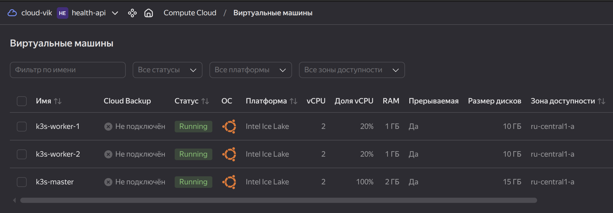

# Table of Contents

- [About the Project](#about-the-project)  
  - [Terragrunt Advantages](#terragrunt-advantages)  
- [terraform/ Configuration](#terraform-configuration)  
  - [Structure](#structure)  
- [Usage Guide](#usage-guide)  
  - [Requirements](#requirements)  
  - [Execution Steps](#execution-steps)  
  - [Running via Makefile](#running-via-makefile)  
    - [Makefile Capabilities](#makefile-capabilities)  
    - [Usage Examples](#usage-examples)  
  - [When Infrastructure is Deployed](#when-infrastructure-is-deployed)  
  - [Possible Issues](#possible-issues)  
- [State and Backend](#state-and-backend)  
- [Implemented DevSecOps Practices](#implemented-devsecops-practices)  
  - [Security Architecture](#security-architecture)  
  - [Coverage](#coverage)  
    - [Basic Checks](#basic-checks)  
    - [Linters and SAST](#linters-and-sast)  
    - [Policy-as-Code](#policy-as-code)  
    - [Configuration and State Security](#configuration-and-state-security)  
    - [CI/CD and Infrastructure](#cicd-and-infrastructure)  
    - [Infrastructure Drift](#infrastructure-drift)  
  - [Result](#result)  
  - [Running Checks](#running-checks)  
  - [OWASP Top-10 Compliance](#owasp-top-10-compliance)  

---

# About the Project

This project is a real IaC deployment of infrastructure in **Yandex Cloud** for the web application [`health-api`](https://github.com/vikgur/health-api-for-microservice-stack-english-vers): network, virtual machines for a k3s cluster, and related resources. The repository is implemented with **Terraform + Terragrunt** and supports [Makefile](#running-via-makefile) and [DevSecOps practices](#implemented-devsecops-practices).

  

**The project applies the IaC "Prod/Stage" pattern via Terragrunt:**

- Shared settings (backend, provider) are placed in the root `terragrunt.hcl`.  
- Configurations are split into independent environments (**stage** and **prod**) to ensure testability and reproducibility.  
- Variables are declared in `terragrunt.hcl` without code duplication.  
- Modules (**network**, **vm**) are reused across environments.  
- All worker ports are initially closed from external access, ensuring security.  

This approach reflects production practices: testing and validating changes in stage before promoting to prod.

## Terragrunt Advantages

Using Terraform through Terragrunt provides production-grade benefits:

- Centralized management of modules and configurations.  
- Elimination of code duplication.  
- Simplified management of multiple environments (**stage** / **prod**).  
- Automatic backend setup for state storage.  
- Unified commands for infrastructure deployment and maintenance.  

---

# terraform/ Configuration

The `terraform/` directory contains infrastructure code for deploying **stage** and **prod** environments in Yandex Cloud using **Terraform** and **Terragrunt**.  
The structure is organized by modularity and environment separation.

## Structure

- **modules/** — directory with reusable Terraform modules.  
  - **network/** — module for creating VPC, subnets, and network resources.  
    - `main.tf` — network resource definitions.  
    - `outputs.tf` — exported values (network ID, subnets, etc.).  
    - `variables.tf` — module input variables.  
  - **vm/** — module for creating virtual machines.  
    - `main.tf` — VM resource definitions (instances, disks, networks).  
    - `outputs.tf` — exported values (IP addresses, VM IDs).  
    - `variables.tf` — module input variables.  

- **terragrunt.hcl** — root Terragrunt config: backend settings for state storage and common Yandex Cloud provider.  

- **live/** — environments (stage and prod) managed via Terragrunt.  
  - **stage/** — environment for testing and release validation.  
    - `terragrunt.hcl` — environment parameters (cloud_id, folder_id, zone, etc.).  
    - **network/terragrunt.hcl** — call of the `network` module for stage.  
    - **vm/terragrunt.hcl** — call of the `vm` module for stage.  
  - **prod/** — production environment.  
    - `terragrunt.hcl` — environment parameters (cloud_id, folder_id, zone, etc.).  
    - **network/terragrunt.hcl** — call of the `network` module for prod.  
    - **vm/terragrunt.hcl** — call of the `vm` module for prod.  

---

# Usage Guide

Instructions are provided for **linux\_amd64 (Ubuntu)**.

## Requirements

* **Terragrunt** and **Terraform** installed.
* `yc` CLI configured (`yc init`), with `yc_token`, `cloud_id`, `folder_id` obtained.
* A bucket created in Yandex Object Storage with **Versioning** and **SSE-KMS** enabled.
* Access keys to Object Storage set in `.env` (not committed to git).

Example `.env`:

```bash
AWS_ACCESS_KEY_ID=yc_access_key
AWS_SECRET_ACCESS_KEY=yc_secret_key
AWS_DEFAULT_REGION=ru-central1
```

## Execution Steps

1. Go to the required environment and service:

   ```bash
   cd live/<stage|prod>/<network|vm>
   ```

2. Initialize backend and provider:

   ```bash
   terragrunt init
   ```

3. View plan:

   ```bash
   terragrunt plan
   ```

4. Apply configuration:

   ```bash
   terragrunt apply -auto-approve
   ```

5. Check outputs:

   ```bash
   terragrunt output
   ```

6. Formatting and validation without applying:

   ```bash
   terragrunt run-all plan
   ```

7. If infrastructure was previously created without remote backend and needs migration:

   ```bash
   terragrunt init -migrate-state
   ```

   For new projects this step is not required — state is stored in Object Storage immediately.

## Running via Makefile

For convenience you can use `make`.

A `Makefile` is added to simplify working with Terragrunt.
It allows managing environments (**stage**, **prod**) and services (**network**, **vm**) through unified commands.

### Makefile Capabilities

* `init` — initialize Terraform backend for the selected environment and service.
* `plan` — view the plan of changes.
* `apply` — apply configuration.
* `destroy` — remove resources.
* `output` — show exported values.

Additionally, there are aliases for applying all services of an environment at once:

* `apply-stage`, `apply-prod` — apply configuration for network + vm.
* `destroy-stage`, `destroy-prod` — delete resources in correct order (vm first, then network).

### Usage Examples

Initialize `stage/network`:

```bash
make init ENV=stage SERVICE=network
```

Plan for `prod/vm`:

```bash
make plan ENV=prod SERVICE=vm
```

Apply all resources in stage:

```bash
make apply-stage
```

Delete all resources in prod:

```bash
make destroy-prod
```
---

## When Infrastructure is Deployed

**Allowed:**

* Make changes only via Terragrunt (`plan` → `apply`).
* Edit modules and `terragrunt.hcl`, applying migrations through Terragrunt.
* Use `terragrunt plan` to check changes and detect drift.
* View `terragrunt output` and use outputs in Ansible/CI/CD.

**Not Allowed:**

* Manually change resources in the cloud via console or `yc` CLI.
* Commit state (`.terraform/`, `.terragrunt-cache/`, `terraform.tfstate`) and `.env` to the repository.
* Run multiple `terragrunt apply` in parallel without remote state locks.

## Possible Issues

* **Unstable init** — if access issues with `registry.terraform.io`, use a VPN or manually download the YC provider and place it in `~/.terraform.d/plugins/...`.
* **IPv6** — may break DNS/API. Temporary fix:

  ```bash
  sudo sysctl -w net.ipv6.conf.all.disable_ipv6=1
  terraform init
  ```

  After finishing — revert back (`disable_ipv6=0`).
* **DNS** — if `registry.terraform.io` is not reachable, change DNS, for example:

  ```bash
  echo "nameserver 1.1.1.1" | sudo tee /etc/resolv.conf > /dev/null
  ```

---

# State and Backend

**State** — the file where Terraform stores the current description of created resources (VM IDs, IPs, networks, etc.). Without state it is impossible to know what is already deployed and what changes are required.  

**Backend** — the mechanism for storing state. A local backend (in `.terraform/`) is insecure and inconvenient for teamwork.  
Best practice is to store state in a centralized and secure storage.

In this project, the backend is configured via **Terragrunt** to use Yandex Object Storage (S3-compatible) with **Versioning** and **SSE-KMS** enabled, which ensures:  

- state preservation (versions are always available);  
- protection (encryption);  
- collaborative team work without conflicts.  

Access keys to Object Storage are taken from the `.env` file, which is excluded from the repository.  

---

# Implemented DevSecOps Practices

## Security Architecture

- **policy/terraform/security.rego** — OPA/Conftest rules (forbid `0.0.0.0/0`, public buckets, no-KMS, require tags).  
- **devsecops_scripts/plan_json.sh** — generates `terragrunt plan` in JSON and runs through policies.  
- **.checkov.yaml** — Checkov config (IaC scanner).  
- **.env** — keys for Object Storage backend (in `.gitignore`, not in Git).  
- **.gitignore** — excludes state, tfvars, secrets, `.env`.  
- **.gitleaks.toml** — rules for secret detection in code.  
- **.pre-commit-config.yaml** — hooks for linters and scanners (fmt, validate, tflint, checkov, gitleaks, yamllint).  
- **.tflint.hcl** — TFLint settings (Terraform linter).  
- **.yamllint.yaml** — YAML style and syntax rules (CI/Helm/Ansible).  
- **Makefile** — `lint-security` target to run all DevSecOps checks with a single command.  

## Coverage

### Basic Checks
- **terragrunt hclfmt / terraform validate** — unified style and syntax validation.  
→ *Secure SDLC principle*: early error detection.

### Linters and SAST
- **TFLint** — provider errors, best practices.  
- **Checkov** — IaC misconfig analysis (open ports, no encryption, public buckets).  
- **Gitleaks** — secret scanning.  
→ Compliance with *OWASP IaC Security* and *CIS Benchmarks*: ban on insecure configs, no hardcoded secrets.

### Policy-as-Code
- **OPA/Conftest** on `terragrunt plan`:  
  - forbid `0.0.0.0/0` in SG,  
  - require KMS encryption,  
  - mandatory tags (Owner/Env/CostCenter).  
→ *OWASP Top-10*:  
  - A5 Security Misconfiguration,  
  - A4 Insecure Design (architecture-level rules).  

### Configuration and State Security
- **Backend in Yandex Object Storage** (S3-compatible) with **Versioning** and **SSE-KMS**.  
- **.env + .gitignore** — secrets only in environment, state and tfvars excluded from Git.  
→ *OWASP A2 Cryptographic Failures*: state protection.  
→ *OWASP A3 Injection*: no secrets in code.  

### CI/CD and Infrastructure
- **Yamllint** — YAML validation.  
- **Stage/prod separation** via Terragrunt — testing on identical environments, no direct prod changes.  
- **Networking principles** — workers without public IPs, master accessed via SSH.  
→ *OWASP A1 Broken Access Control*: minimal external entry points.  
→ *OWASP A5 Security Misconfiguration*: deny by default.  

### Infrastructure Drift
- Checks with `terragrunt plan -detailed-exitcode` to detect drift between code and real resources.  
→ *Continuous Compliance principle*.  

---

## Result

- Key DevSecOps practices implemented for Terraform/Terragrunt: SAST, Policy-as-Code, secret scanning, state and drift control.  
- Protection ensured against major OWASP Top-10 categories (*Security Misconfiguration, Insecure Design, Cryptographic Failures, Broken Access Control, Secrets Management*).  
- Infrastructure managed declaratively, testable and secure, with no manual changes in production.  

---

## Running Checks

All checks are combined into a single command:

```bash
make lint-security
```

This command runs the full set of DevSecOps checks:

* Terraform formatting and validation,
* linting via **TFLint**,
* IaC misconfig analysis via **Checkov**,
* secret scanning via **Gitleaks**,
* YAML validation via **Yamllint**,
* `plan.json` generation and policy validation via **Conftest**.

---

## OWASP Top-10 Compliance

Quick mapping of project practices to OWASP Top-10:

* **A1 Broken Access Control** → network pattern: workers without public IPs, master accessible only via SSH.
* **A2 Cryptographic Failures** → backend in Yandex Object Storage with SSE-KMS and versioning, secrets in `.env` (outside Git).
* **A3 Injection** → no secrets in code, tfvars and state not stored in Git, leaks detection via Gitleaks.
* **A4 Insecure Design** → OPA/Conftest policies on `terragrunt plan` (mandatory tags, KMS, ban on 0.0.0.0/0).
* **A5 Security Misconfiguration** → Checkov and TFLint: forbid insecure resources (open ports, public buckets).
* **A6 Vulnerable and Outdated Components** → TFLint and Checkov detect outdated/unsupported resources and providers.
* **A7 Identification and Authentication Failures** → access control through Object Storage backend with versioning, secrets only in Vault/.env.
* **A8 Software and Data Integrity Failures** → CI runs terraform validate/plan, drift detection, Conftest rules.
* **A9 Security Logging and Monitoring Failures** → planning and recording `terragrunt plan` in CI, drift control via detailed-exitcode.
* **A10 SSRF** → use of only trusted Terraform providers, limitation of external data sources.
